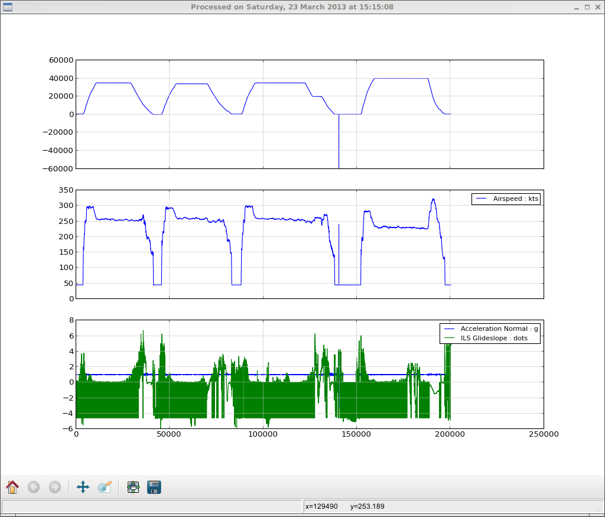
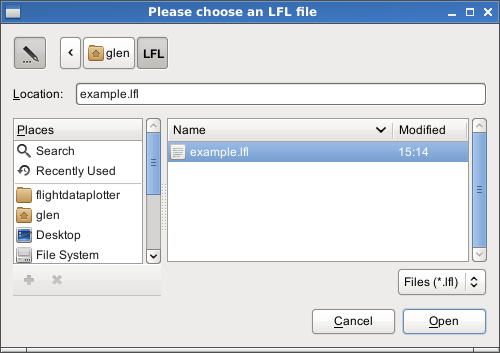
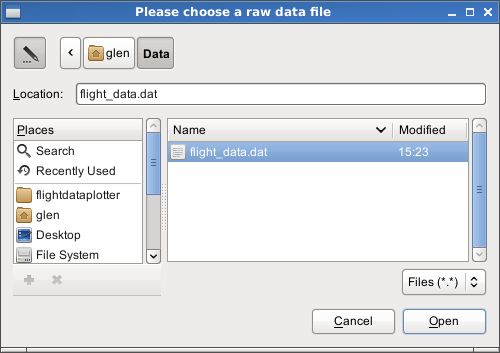

=================
FlightDataPlotter
=================

The FlightDataPlotter is an application which displays logical frame layout parameters and is designed to provide responsive feedback during LFL development.

--------------------
Logical Frame Layout
--------------------

The parameters to display are defined within the LFL file in AXIS_n parameter groups.

.. code-block:: ini
   
   [Parameter Group]
   
   AXIS_1 = Airspeed,
   AXIS_2 = Acceleration Normal, ILS Glideslope

The Altitude STD parameter is always displayed in the uppermost chart as a point of reference.

-----------------------------
Running the FlightDataPlotter
-----------------------------

The application is started by running plot_params.py. If no arguments are provided, you will be asked to select an LFL file followed by a data file.

Alternatively, these paths may be provided as arguments.

.. code-block:: bash
   
   $ python plot_params.py example.lfl flight_data.dat

If the data is frame doubled, the -d option must be added.

.. code-block:: bash
   
   $ python plot_params.py -d example.lfl flight_data.dat

If an error occurs during processing or when parsing the LFL file an error dialog will be displayed.

----------------------
Developing a parameter
----------------------

To use the FlightDataPlotter during the development of a parameter, first add the parameter to an AXIS group. Run the FlightDataPlotter specifying both the LFL and raw data file paths.

Each time an update is made to the logical frame layout, the data will be reprocessed against the updated LFL. Close the charting window to display the updated results of processing. Repeat these steps until the parameter definition is completed.

Closing the application's terminal window will end the FlightDataPlotter process.